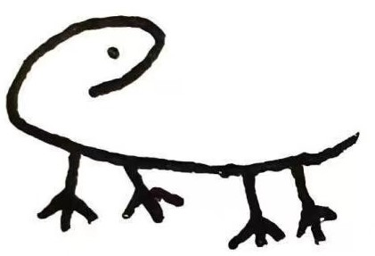

<link rel="stylesheet" href="https://cdn.jsdelivr.net/npm/aplayer@1.7.0/dist/APlayer.min.css">

#       Welcome to My Page

Hi, 我来自控制科学与工程学院，欢迎来到我的主页

<video controls>  
  <source src="./videos/镇海棘螈 为何被称作宁波的“大熊猫”/video1.mp4" type="video/mp4">  
  Your browser does not support the video tag.  
</video>  

我超喜欢这个音乐​​😃

## Introduction

本主页包括以下内容：

### 技术文档

主要记录自己在实操中的路径，希望能让后来者少踩坑qaq

### MATHE

记录一些最最“基础”的理论或工科数学知识

### Robotics

记录有关硬件选型等的内容